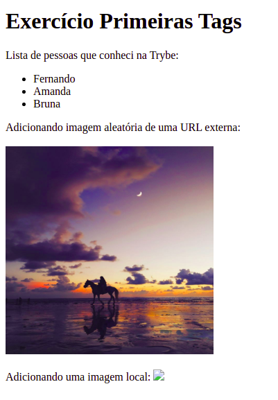
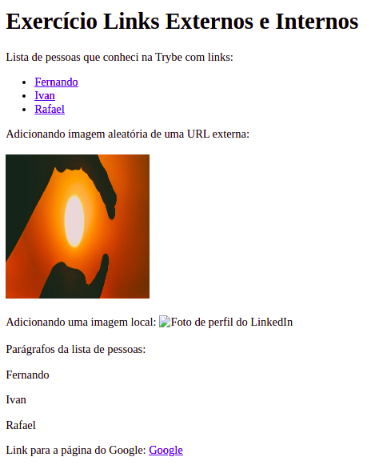

# Exercício Primeiras Tags

Neste exercício tivemos contato com as primeiras tags HTML e entendemos como os elementos se relacionam, criando uma página simples com título, lista e imagens (no código foi adicionada uma imagem local que não se encontra mais entre nós, por isso não aparece na página).

  

# Exercício Links Externos e Internos

Neste exercício treinamos como criar parágrafos, linkamos a lista anteriormente criada e os parágrafos, e por fim implementamos um link externo para o Google.

  

