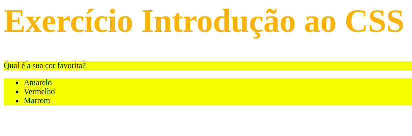

# Exercício Introdução ao CSS 

Neste exercício criamos as nossas primeiras regras com CSS. Com um título e uma lista não-ordenada simples, modificamos o tamanho da fonte, a cor do texto e a cor de fundo, além de treinar como mudar a cor de várias tags ao mesmo tempo.

  

