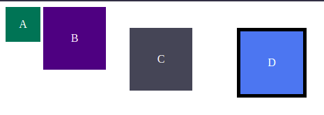
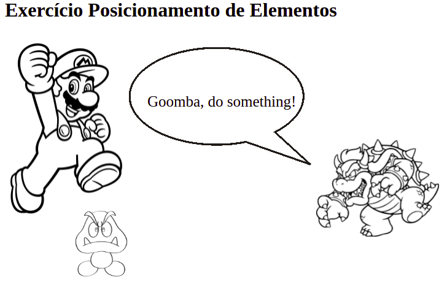
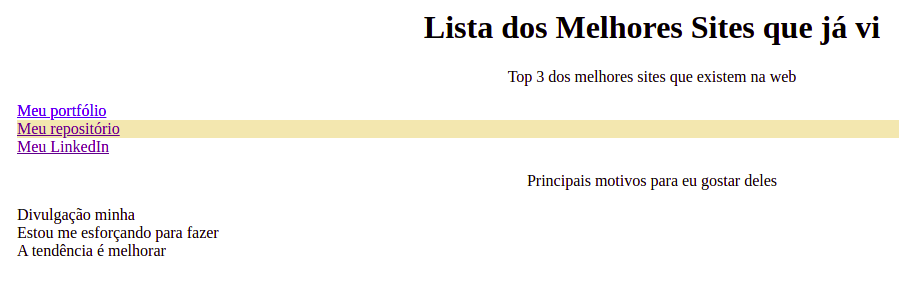
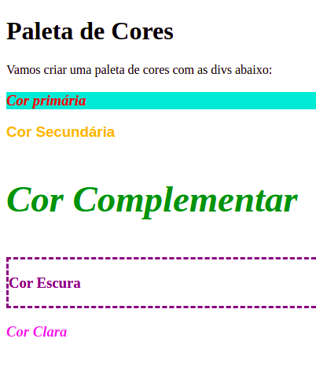

# Exercício Box Model

Neste exercício trabalhamos a compreensão do modelo de caixas observando melhor o comportamento de algumas propriedades como padding, margin e border e como elas afetam os elementos da página.

  

# Exercício Posicionamento de Elementos

Neste exercício treinamos como manipular o posicionamento de elementos HTML utilizando o CSS, montando um cenário coeso.

  

# Exercício Agrupamento de Seletores

Neste exercício treinamos como agrupar seletores para estilizar a página com mais praticidade, implementando funcionalidades diferentes como alterar propriedades de várias tags de uma só vez, mudar a cor de fundo ao passar o cursor sobre um item e mudar a fonte e a cor ao clicar em um link.

  

# Exercício Pseudoclasses

Neste exercício não atribuimos nenhuma classe ou id aos componentes, apenas treinamos a utilização de pseudoclasses para estilizá-los, mudando as cores, a fonte, e adicionando uma borda ao passar o cursor por cima.

  

